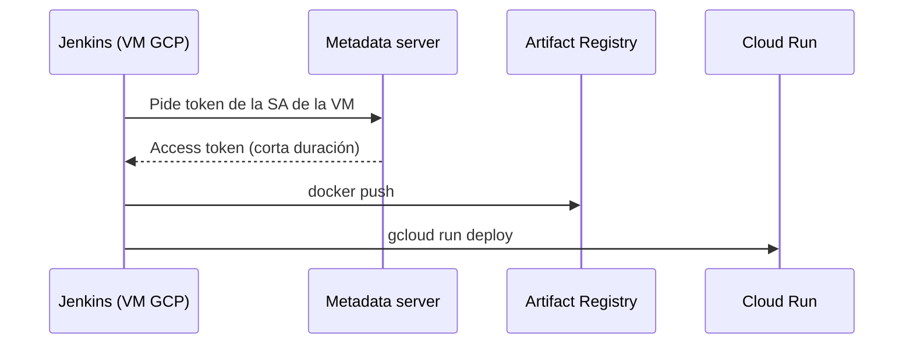

# LAB: Jenkins en una VM de GCP + Artifact Registry + Cloud Run

Objetivo: que el [Jenkinsfile](Jenkinsfile) se autentique en GCP **sin llaves JSON ni OIDC**, usando la Service Account asociada a la VM donde corre Jenkins (credenciales del servidor de metadatos).



El contenedor `google/cloud-sdk` de las etapas del pipeline hereda esa identidad: `gcloud` consulta el metadata server automáticamente.

## 1. Variables (Cloud Shell)

```bash
export PROJECT_ID="sanbox-aldo-prod"
export PROJECT_NUMBER=$(gcloud projects describe $PROJECT_ID --format='value(projectNumber)')
export REGION="us-central1"
export ZONE="us-central1-a"
export AR_REPO="container-repository-gemini-at"
export VM_NAME="jenkins-vm"                 # nombre de tu VM
export SA_NAME="jenkins-deployer"
export SA_EMAIL="$SA_NAME@$PROJECT_ID.iam.gserviceaccount.com"
```

## 2. APIs

```bash
gcloud services enable artifactregistry.googleapis.com run.googleapis.com \
  iam.googleapis.com cloudresourcemanager.googleapis.com --project $PROJECT_ID
```

## 3. Repositorio de Artifact Registry (si no existe)

```bash
gcloud artifacts repositories create $AR_REPO \
  --project=$PROJECT_ID --location=$REGION --repository-format=docker
```

## 4. Service Account y permisos

```bash
gcloud iam service-accounts create $SA_NAME --project=$PROJECT_ID \
  --display-name="Jenkins deployer"

# Push de imágenes
gcloud artifacts repositories add-iam-policy-binding $AR_REPO \
  --project=$PROJECT_ID --location=$REGION \
  --member="serviceAccount:$SA_EMAIL" --role="roles/artifactregistry.writer"

# Deploy en Cloud Run
gcloud projects add-iam-policy-binding $PROJECT_ID \
  --member="serviceAccount:$SA_EMAIL" --role="roles/run.admin"

# Cloud Run ejecuta con la SA por defecto de Compute: permitir actuar como ella
gcloud iam service-accounts add-iam-policy-binding \
  $PROJECT_NUMBER-compute@developer.gserviceaccount.com \
  --project=$PROJECT_ID \
  --member="serviceAccount:$SA_EMAIL" --role="roles/iam.serviceAccountUser"
```

## 5. Asociar la SA a la VM de Jenkins

Hay que detener la VM para cambiar su service account.

```bash
gcloud compute instances stop $VM_NAME --zone=$ZONE --project=$PROJECT_ID

gcloud compute instances set-service-account $VM_NAME \
  --zone=$ZONE --project=$PROJECT_ID \
  --service-account=$SA_EMAIL \
  --scopes=https://www.googleapis.com/auth/cloud-platform

gcloud compute instances start $VM_NAME --zone=$ZONE --project=$PROJECT_ID
```

El scope `cloud-platform` es necesario: con los scopes por defecto el push o el deploy fallan aunque la SA tenga los roles.

## 6. Preparar la VM y el contenedor de Jenkins

Jenkins corre en un contenedor Docker. Conectarse (`gcloud compute ssh $VM_NAME --zone=$ZONE`) y verificar:

```bash
# Identidad de la VM
curl -s -H "Metadata-Flavor: Google" \
  http://metadata.google.internal/computeMetadata/v1/instance/service-accounts/default/email

# Nombre del contenedor y sus montajes
docker ps --format '{{.Names}}\t{{.Image}}\t{{.Ports}}'
export JK=jenkins   # reemplazar por el nombre real
docker inspect $JK --format '{{range .Mounts}}{{.Source}} -> {{.Destination}}{{"\n"}}{{end}}'
```

Requisitos del contenedor:

- Montar `/var/run/docker.sock:/var/run/docker.sock` y `jenkins_home` en `/var/jenkins_home` (volumen persistente).
- Tener el CLI de Docker: `docker exec $JK docker version`. Si falta, instalarlo en la imagen.
- El usuario `jenkins` del contenedor debe poder usar el socket (ver troubleshooting).

Autenticar Docker **dentro del contenedor** contra Artifact Registry (el `docker push` corre ahí). Se usa `docker-credential-gcr`, que pide el token a la SA de la VM en cada push, así no caduca:

```bash
docker exec -u root $JK bash -c '
  curl -fsSL https://github.com/GoogleCloudPlatform/docker-credential-gcr/releases/download/v2.1.22/docker-credential-gcr_linux_amd64-2.1.22.tar.gz \
  | tar xz -C /usr/local/bin docker-credential-gcr'

docker exec -u jenkins $JK docker-credential-gcr configure-docker \
  --registries=us-central1-docker.pkg.dev
```

- Ajustar la versión si cambia (releases del proyecto `docker-credential-gcr`).
- Escribe `credHelpers` en `/var/jenkins_home/.docker/config.json`, que persiste en el volumen.
- Si recreas el contenedor sin ese volumen, incluir el binario en la imagen de Jenkins.

Prueba:

```bash
docker exec -u jenkins $JK docker pull us-central1-docker.pkg.dev/$PROJECT_ID/$AR_REPO/<imagen>:<tag>
```

## 7. Configuración en Jenkins

1. Plugin **Docker Pipeline** instalado (para `agent { docker {...} }`).
2. Contenedor con acceso a `/var/run/docker.sock` (sección 6).
3. Crear el job (Pipeline o Multibranch) apuntando a este repo; usa el `Jenkinsfile` de la raíz.
4. No se necesitan credenciales de GCP en Jenkins.

## 8. Cómo lo usa el pipeline

- **GCP & Docker Auth**: `gcloud config set project` y `configure-docker` dentro del contenedor `cloud-sdk`.
- **Build and Push Image**: `docker build/push` dentro del contenedor de Jenkins (vía `docker.sock`), con el credential helper de la sección 6.
- **Deploy to Cloud Run**: `gcloud run deploy` en un contenedor `cloud-sdk`, autenticado por el metadata server.

## 9. Verificación y troubleshooting

```bash
gcloud compute instances describe $VM_NAME --zone=$ZONE --project=$PROJECT_ID \
  --format="value(serviceAccounts[0].email,serviceAccounts[0].scopes)"
```

| Error | Causa |
|---|---|
| `Request had insufficient authentication scopes` | La VM no tiene el scope `cloud-platform` (sección 5) |
| `denied: Permission artifactregistry.repositories.uploadArtifacts` | Falta `artifactregistry.writer` o falta el credential helper en el contenedor (sección 6) |
| `unauthenticated: ... docker login` en el push | `docker-credential-gcr configure-docker` no se ejecutó como usuario `jenkins` del contenedor |
| `iam.serviceaccounts.actAs` en deploy | Falta `serviceAccountUser` sobre la SA de runtime |
| `Permission 'run.services.create' denied` | Falta `roles/run.admin` |
| `permission denied ... docker.sock` | El usuario `jenkins` del contenedor no accede al socket: levantar el contenedor con `--group-add $(stat -c %g /var/run/docker.sock)` o `-u root` |
| `gcloud` en el contenedor pide login | El contenedor no alcanza el metadata server; no usar `--network none` |

## Alternativa: OIDC / Workload Identity Federation

Solo es necesaria si Jenkins corre **fuera** de GCP (otra nube u on-premise). Requiere el plugin *OpenID Connect Provider* y un issuer `https://` (real, o ficticio con `--jwk-json-path`). Dentro de GCP la SA asociada a la VM es más simple y no necesita tokens que mantener.
