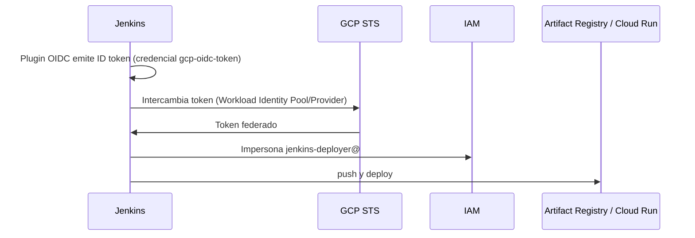

# LAB: Jenkins + GCP con OpenID Connect (Workload Identity Federation)

Objetivo: que el pipeline del [Jenkinsfile](Jenkinsfile) se autentique en GCP sin llaves JSON, usando un ID token OIDC emitido por Jenkins.



## 0. Requisitos

- Jenkins con URL **HTTPS pública** (GCP debe leer `https://JENKINS_URL/oidc/.well-known/openid-configuration` y el JWKS). Si Jenkins es privado, ver sección 3.1.
- `gcloud` autenticado como administrador del proyecto.
- Agente Jenkins con Docker y permiso para ejecutar contenedores (`/var/run/docker.sock`).

## 1. Variables

```bash
export PROJECT_ID="sanbox-aldo-prod"
export PROJECT_NUMBER=$(gcloud projects describe $PROJECT_ID --format='value(projectNumber)')
export REGION="us-central1"
export AR_REPO="container-repository-gemini-at"
export POOL="jenkins-pool"
export PROVIDER="jenkins-provider"
export SA_NAME="jenkins-deployer"
export SA_EMAIL="$SA_NAME@$PROJECT_ID.iam.gserviceaccount.com"
export JENKINS_URL="https://jenkins.midominio.com"   # sin "/" final
```

Copiar el valor de `$PROJECT_NUMBER` en `GCP_PROJECT_NUMBER` del Jenkinsfile.

## 2. APIs

```bash
gcloud services enable iam.googleapis.com iamcredentials.googleapis.com \
  sts.googleapis.com artifactregistry.googleapis.com run.googleapis.com \
  cloudresourcemanager.googleapis.com --project $PROJECT_ID
```

## 3. Workload Identity Pool y Provider

```bash
gcloud iam workload-identity-pools create $POOL \
  --project=$PROJECT_ID --location=global \
  --display-name="Jenkins Pool"

gcloud iam workload-identity-pools providers create-oidc $PROVIDER \
  --project=$PROJECT_ID --location=global \
  --workload-identity-pool=$POOL \
  --issuer-uri="$JENKINS_URL/oidc" \
  --allowed-audiences="gcp" \
  --attribute-mapping="google.subject=assertion.sub" \
  --attribute-condition="assertion.sub.startsWith('jenkins')"
```

- `--allowed-audiences` debe coincidir con el **Audience** de la credencial en Jenkins (sección 6).
- Restringe `attribute-condition` a tu job/folder si es posible (el `sub` lo define el plugin; revisa un token real en jwt.io).

### 3.1 Jenkins no accesible desde internet

Descargar `JWKS` de `$JENKINS_URL/oidc/jwks` y subirlo al provider (reemplaza `--issuer-uri` discovery):

```bash
curl -s $JENKINS_URL/oidc/jwks > jwks.json
gcloud iam workload-identity-pools providers create-oidc $PROVIDER \
  ... (mismos parámetros) --jwk-json-path=jwks.json
```

Si Jenkins rota llaves, hay que actualizar el JWKS.

## 4. Service Account y permisos

```bash
gcloud iam service-accounts create $SA_NAME --project=$PROJECT_ID \
  --display-name="Jenkins deployer"

# Push de imágenes
gcloud artifacts repositories add-iam-policy-binding $AR_REPO \
  --project=$PROJECT_ID --location=$REGION \
  --member="serviceAccount:$SA_EMAIL" --role="roles/artifactregistry.writer"

# Deploy en Cloud Run
gcloud projects add-iam-policy-binding $PROJECT_ID \
  --member="serviceAccount:$SA_EMAIL" --role="roles/run.admin"

# Cloud Run ejecuta con la SA por defecto de Compute: permitir actuar como ella
gcloud iam service-accounts add-iam-policy-binding \
  $PROJECT_NUMBER-compute@developer.gserviceaccount.com \
  --project=$PROJECT_ID \
  --member="serviceAccount:$SA_EMAIL" --role="roles/iam.serviceAccountUser"
```

## 5. Permitir que la identidad federada impersone la SA

Todo el pool:

```bash
gcloud iam service-accounts add-iam-policy-binding $SA_EMAIL \
  --project=$PROJECT_ID \
  --role="roles/iam.workloadIdentityUser" \
  --member="principalSet://iam.googleapis.com/projects/$PROJECT_NUMBER/locations/global/workloadIdentityPools/$POOL/*"
```

Solo un subject concreto (más seguro):

```bash
  --member="principal://iam.googleapis.com/projects/$PROJECT_NUMBER/locations/global/workloadIdentityPools/$POOL/subject/<SUB_DEL_TOKEN>"
```

## 6. Configuración en Jenkins

1. **Instalar plugin**: *Manage Jenkins > Plugins > Available* → **OpenID Connect Provider** (`oidc-provider`). Reiniciar.
2. **Jenkins URL**: *Manage Jenkins > System > Jenkins Location* → `Jenkins URL` = `$JENKINS_URL` (HTTPS, debe coincidir con el issuer).
3. **Credencial**: *Manage Jenkins > Credentials > (global) > Add Credentials*
   - Kind: **OpenID Connect id token**
   - ID: `gcp-oidc-token`
   - Audience: `gcp` (igual que `--allowed-audiences`)
   - Issuer: dejar por defecto (`<Jenkins URL>/oidc`)
4. **Docker**: el usuario de Jenkins debe poder usar Docker y el agente montar `/var/run/docker.sock`. Plugin **Docker Pipeline** instalado (para `agent { docker {...} }`).
5. **Multibranch / Pipeline**: crear el job apuntando a este repo (usa el `Jenkinsfile` de la raíz).
6. Editar en el [Jenkinsfile](Jenkinsfile): `GCP_PROJECT_NUMBER`, `WIF_POOL`, `WIF_PROVIDER`, `WIF_SERVICE_ACCOUNT` según las variables de la sección 1.

## 7. Cómo lo usa el pipeline

- `gcpAuth()` lee el token de la credencial `gcp-oidc-token`, genera un archivo de credenciales externas con `gcloud iam workload-identity-pools create-cred-config` y hace `gcloud auth login --cred-file`.
- La etapa **GCP Auth (OIDC)** además guarda un access token temporal para que `docker login` (en el host) autentique contra Artifact Registry; se borra en `post`.
- **Deploy to Cloud Run** vuelve a autenticarse (cada contenedor es nuevo).

## 8. Verificación y troubleshooting

```bash
curl -s $JENKINS_URL/oidc/.well-known/openid-configuration
gcloud iam workload-identity-pools providers describe $PROVIDER \
  --workload-identity-pool=$POOL --location=global --project=$PROJECT_ID
```

| Error | Causa |
|---|---|
| `invalid_grant` / `audience` | Audience de la credencial ≠ `--allowed-audiences` |
| `The given credential is rejected by the attribute condition` | `attribute-condition` no cumple con el `sub` real |
| `Permission 'iam.serviceAccounts.getAccessToken' denied` | Falta `workloadIdentityUser` (sección 5) o API `iamcredentials` |
| `unable to fetch jwks` | Jenkins no accesible; usar `--jwk-json-path` |
| `denied: Permission artifactregistry.repositories.uploadArtifacts` | Falta `artifactregistry.writer` |
| `iam.serviceaccounts.actAs` en deploy | Falta `serviceAccountUser` sobre la SA de runtime |
| `docker: command not found` en etapa Build | El agente no tiene Docker instalado |
